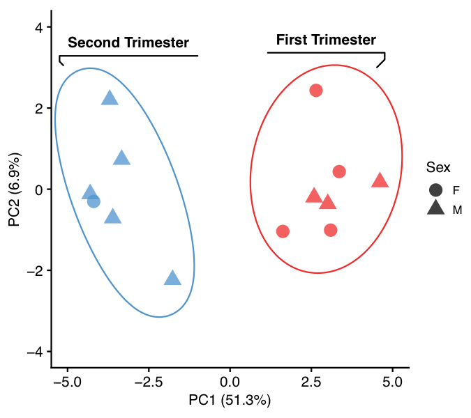
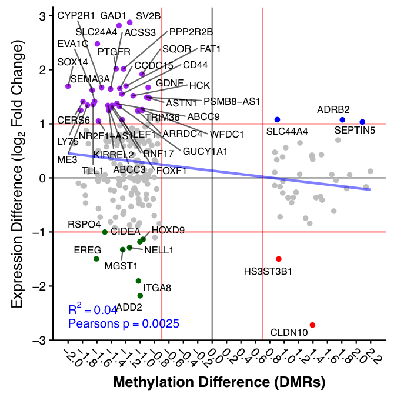
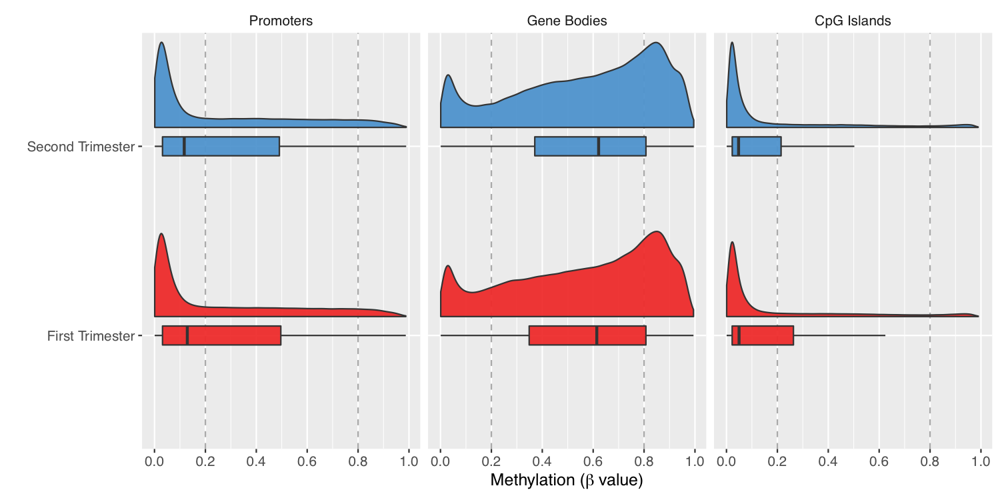

# Transcriptome analysis reveals differences in human placental metabolism, transport and endocrine function across the first-second trimester transition #

**Malwina Pratera, Russell S. Hamiltona, Hong Wa Yunga, Andrew M. Sharkeya,b, Paul Robsonc, Eric Jauniauxd, D. Stephen Charnock-Jonesa,e,f, Graham J. Burtona,§, Tereza Cindrova-Daviesa,§**

a Centre for Trophoblast Research, Department of Physiology, Development and Neuroscience, University of Cambridge, Downing Street, Cambridge, CB2 3EG, UK.
b Department of Pathology, University of Cambridge, Tennis Court Road, Cambridge, CB2???
c Jackson Labs.
d EGA Institute for Women’s Health, Faculty of Population Health Sciences.  University College London, London, WC1E 6BT, UK.
e Department of Obstetrics and Gynaecology, University of Cambridge, The Rosie Hospital, Cambridge, CB2 0SW, UK
f National Institute for Health Research, Cambridge Biomedical Research Centre.

§ These authors contributed equally

# Methylation Analysis

## Infinium Methylation EPIC array

Genomic DNA was isolated by QIAamp DNA mini kit (Qiagen, cat. no. 51304) following manufacturer’s instructions. Buffer AL (200&mu;l) was added to the sample, mixed by pulse-vortexing for 15 sec, before incubating at 70&deg;C for 10 min. Absolute Ethanol (200&mu;l) was then added to the sample, and mixed by pulse-vortexing for 15 sec before transferring to the QIAamp Mini spin column and centrifuged at 6000g for 1 min. The Mini spin column was washed once with Buffer AW1 (500&mu;l) following by Buffer AW2 (500&mu;l) before centrifuging at full speed for 1 min. For elution of genomic DNA, DNase-free water (100&mu;l) was added and incubated for 1 min before centrifuging at 6000g for 1 min. The step repeated one more time with another 100&mu;l DNase-free water. DNA concentration of the samples were quantified by NanoDrop and the DNA quality was checked by resolving in 0.8% agarose gel, in which there was a major band visualized at around 10 kbp without obvious smear below, indicating good quality DNA.

Genomic DNA was subjected to oxidative bisulfite (oxBS) conversion using the CEGX TrueMethyl kit (Cambridge Epigenetix / NuGEN,  cat. no. CEGXTMS) and used for microarray-based DNA methylation analysis, performed at GenomeScan (GenomeScan B.V., Leiden, The Netherlands) on the HumanMethylation850 BeadChip (Illumina, Inc., San Diego, CA, U.S.A). The resulting iDAT files were imported and analysed using ChAMP (v2.9.10) [1,2]. The EPIC array assays approximately 865,000 CpG sites  Samples were processed filtering for a probe detection p-value <= 0.01, probes with a beadcount <3 in at least 5% of samples, no CpG and known SNPs[3] at probe starts, probes aligning to multiple locations,  and QC using the on array control probes. In total, 750150 probes on the array passed the filtering and QC steps. The BMIQ[4] method was used to normalise the two probe types (I and II) present on the array. Beta methylation values from the EPIC array range from 0 (unmethylated) to 1 (methylated) and are equivalent to percentage methylation.

EPIC methylation array data have been deposited in the ArrayExpress database at EMBL-EBI under accession number E-MTAB-XXXX (https://www.ebi.ac.uk/arrayexpress/experiments/E-MTABXXXX). Code used to analyse the EPIC array samples is available at https://github.com/darogan/First_Second_Trimester_Methylation

[Rscript 1](Correlate_DMRs_2_RNA.R )
[Rscript 2](CTR_EPIC.PrePost.analysis.R)

### EPIC Methylation Array Sample Table ###

| Sample  | iDAT FileName |
|---------|-----------------|
| first_63_oxBS | 202123800269_R04C01_{Red/Grn}.idat |
| first_64_oxBS | 202123800269_R02C01_{Red/Grn}.idat |
| first_65_oxBS | 202123800167_R06C01_{Red/Grn}.idat |
| first_66_oxBS | 202123800269_R08C01_{Red/Grn}.idat |
| first_67_oxBS | 202128330113_R02C01_{Red/Grn}.idat |
| first_69_oxBS | 202128330113_R04C01_{Red/Grn}.idat |
| first_70_oxBS | 202128330113_R06C01_{Red/Grn}.idat |
| second_71_oxBS | 202139520259_R04C01_{Red/Grn}.idat |
| second_72_oxBS | 202139520259_R06C01_{Red/Grn}.idat |
| second_73_oxBS | 202139520259_R08C01_{Red/Grn}.idat |
| second_74_oxBS | 202123800167_R02C01_{Red/Grn}.idat |
| second_75_oxBS | 202123800269_R06C01_{Red/Grn}.idat |
| second_76_oxBS | 202123800167_R04C01_{Red/Grn}.idat |

[iDAT Sample sheet](SampleSheet_Infinium_MethylationEPIC_103409-001.csv)

##### Sample Clustering #####

##### Methylation Correlation: First Vs Second trimester #####

##### Methylation Vs Expression Correlation #####

##### Methylation Vs Genomic Features #####

 

##### Methylation Vs Expression Heatmaps #####

|   |   |
|---------|-----------------|
|  |        |

### References ###
1.	Morris, T. J. et al. ChAMP: 450k Chip Analysis Methylation Pipeline. Bioinformatics 30, 428–430 (2014).
2.	Aryee, M. J. et al. Minfi: A flexible and comprehensive Bioconductor package for the analysis of Infinium DNA methylation microarrays. Bioinformatics 30, 1363–1369 (2014).
3.	Zhou, W., Laird, P. W., Shen, H., Infinium, I. & Methylation, D. N. A. Comprehensive characterization, annotation and innovative use of Infinium DNA methylation BeadChip probes. Nucleic Acids Res. 45, e22 (2017).
4.	Teschendorff, A. E. et al. A beta-mixture quantile normalization method for correcting probe design bias in Illumina Infinium 450 k DNA methylation data. Bioinformatics 29, 189–196 (2013).

### Links ###

Description   | URL
------------- | ----------
Publication   | [Journal](https://) and [DOI](https://doi.org/)
Raw Data (EPIC) | ArrayExpress EMBL-EBI [E-MTAB-XXXX](https://www.ebi.ac.uk/arrayexpress/experiments/E-MTAB-XXXX)

### Contact

Contact Russell S. Hamilton (rsh46@cam.ac.uk) for bioinformatics related queries.
